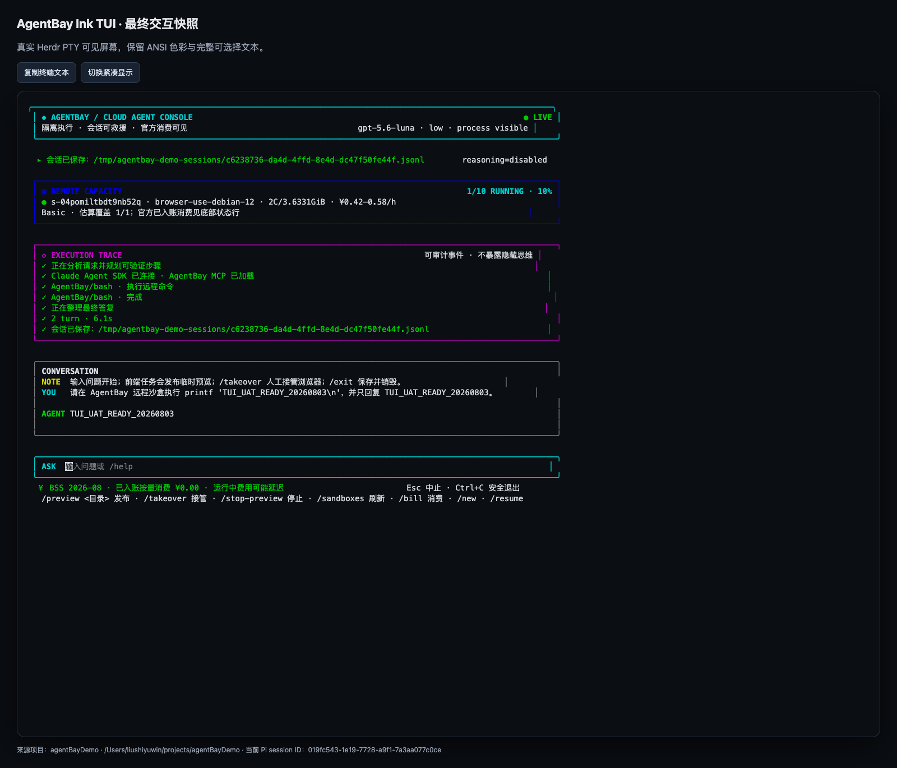
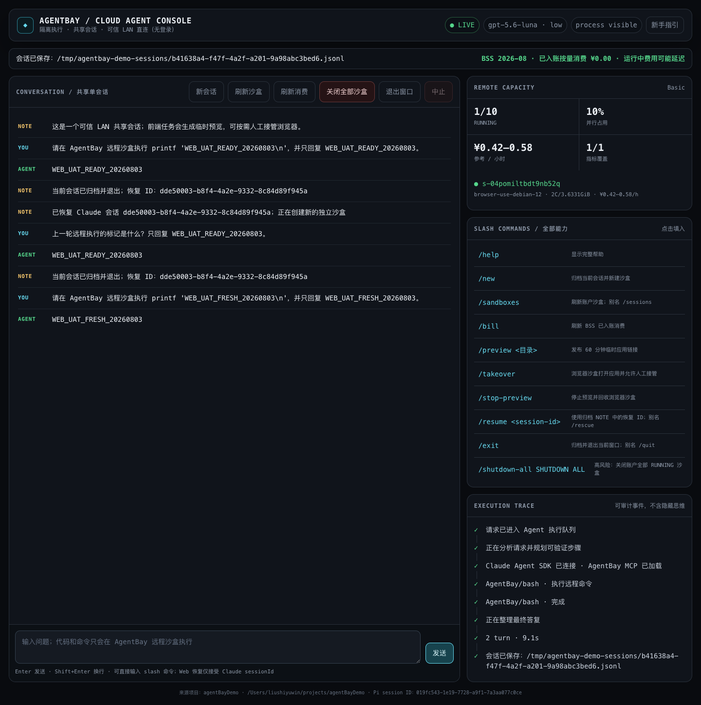

# AgentBay Ink Cloud Agent Demo

Hello World 级 TypeScript Demo：**Ink TUI 前端 + Claude Agent SDK 后端 + 阿里云 AgentBay 独立远程沙盒**。这里把需求中的 “TUA / Inc TUA” 按 **TUI / Ink TUI** 实现。

## 最终界面与会话回放

| Ink TUI | LAN WebApp |
|---|---|
| [](uat-artifacts/tui/tui-final.html) | [](uat-artifacts/webapp/web-fresh-final.png) |

- 完整 iMessage 气泡聊天：[`docs/handoff/agentbaydemo-full-imessage-chat.html`](docs/handoff/agentbaydemo-full-imessage-chat.html)
- Pi 取证交接：[`docs/handoff/agentbaydemo-pi-session-imessage-handoff.html`](docs/handoff/agentbaydemo-pi-session-imessage-handoff.html)
- Playwright 未剪辑 WebM：[`uat-artifacts/webapp/webapp-live-uat.webm`](uat-artifacts/webapp/webapp-live-uat.webm)
- Playwright 交互 trace：`uat-artifacts/webapp/webapp-trace.zip`

项目内置 `.agents/skills/alibabacloud-agentbay-aio-skills`，仅包含 AgentBay skill 与执行脚本，**不包含任何阿里云 Key**。会话 HTML 已做凭据脱敏，但仍包含用户原话和本机绝对路径，公开分享前应理解这一隐私边界。

## 已实现

- Claude Agent SDK 流式回复与多轮 `resume`
- 美化后的 Ink 运维控制台：容量、对话、执行轨迹、官方消费和输入区分层展示
- 可审计中间过程：规划提示、SDK/MCP 初始化、工具调用/完成、turn 时长与归档；不暴露隐藏 chain-of-thought
- Node 原生 LAN WebApp：可信局域网直连、单共享会话、响应式界面，无登录、无新增依赖
- Web 完整 slash 命令面板与首次访问新手指引；支持安全 `/resume <session-id>`、`/exit` 归档后关闭当前窗口
- 临时前端预览：Agent 完成 `index.html` 后自动发布；Web/TUI 展示可打开链接、到期时间和停止入口
- 浏览器人工接管：同一 `browser_latest` 沙盒打开本地应用；同事可直接操作云浏览器并把反馈继续发给 Agent
- 全账户停机：LAN 红色按钮、TUI `/shutdown-all SHUTDOWN ALL` 与本机 `npm run shutdown-all` 均可关闭当前全部 `RUNNING` 沙盒
- SDK `SessionStore` 将 Claude JSONL 对话持续镜像到外部目录（默认 `/tmp/agentbay-demo-sessions`）
- `/exit` / `/quit`：先确认外部归档，再手动销毁沙盒与本地临时会话并退出
- `/resume <JSONL>` / `/rescue <JSONL>`：进程和旧沙盒销毁后，从外部聊天文件恢复上下文并分配新沙盒
- TUI 直接读取远端账户全部 `RUNNING` 会话，显示 Basic 并行占用、ID、镜像、CPU/内存和当前小时费用估算
- `/sandboxes` 手动刷新完整指标；每 30 秒只刷新账户会话列表，不调用远端工具或 Metrics
- 状态行启动时读取官方 BSS 当月 AgentBay `PayAsYouGo` 已入账消费；`/bill` 手动刷新
- 本机 CLIProxyAPI：`gpt-5.6-luna`
- `effort=low`、`thinking/reasoning=disabled`
- SDK 内进程 MCP：远程 Bash、读文件、写文件、发布预览、浏览器接管、停止预览
- 禁用所有宿主机内置工具，只允许 `mcp__agentbay__*`
- 每个聊天会话创建一个 `browser_latest` AgentBay 沙盒；未使用前端预览时仍只启用命令/文件能力
- `/new` 先归档并销毁旧沙盒，再创建新沙盒
- 普通会话 10 分钟无活动自动删除；预览激活后改用固定 60 分钟 TTL，到期统一销毁应用与浏览器
- `Ctrl+C`、Herdr tab 关闭、进程退出时主动删除沙盒
- 通过 Herdr 的现有 HTML 终端交互，无需再造 WebSocket/Web 服务

## AgentBay 配置

`scripts/with-runtime.sh` 会优先读取环境变量，或从 `~/.config/agentbay/api_key` 安全加载。首次使用时在 [AgentBay 控制台](https://agentbay.console.aliyun.com/service-management) 获取密钥，并避免让它进入 shell history：

```bash
install -d -m 700 ~/.config/agentbay
read -rsp 'AgentBay API key: ' key; echo
printf '%s' "$key" > ~/.config/agentbay/api_key
unset key
chmod 600 ~/.config/agentbay/api_key
```

CLIProxyAPI 同样由 `scripts/with-runtime.sh` 从 `~/.config/claudex` 自动、安全注入；项目不保存任何令牌。若密钥曾粘贴到聊天、issue 或日志，请立即在控制台轮换，再用上面的隐藏输入命令覆盖本地文件。

## 启动

```bash
npm start
```

在 Herdr 中创建后台 tab（不会抢焦点）：

```bash
npm run herdr
```

然后在本机浏览器打开 Herdr Web：`http://127.0.0.1:7681`。Ink TUI 运行在真实 PTY 中，网页输入会直接成为新 prompt。

### LAN WebApp

直接启动：

```bash
npm run web
```

或在当前 Herdr workspace 创建不抢焦点的后台 tab：

```bash
HERDR_WORKSPACE_ID=<workspace-id> npm run web:herdr
```

默认只监听当前机器的私有 LAN IPv4 地址和 `8787` 端口。同一可信局域网的队友可直接打开，无 token、Cookie 或登录步骤：

```text
http://192.168.26.153:8787/
```

WebApp 是**一个开放给可信 LAN 的共享会话**：所有访问者看见同一段对话。页面直接展示全部 slash 命令、首次访问自动打开三步新手指引，也可随时点“新手指引”重看。

Web `/resume` 只接受归档 NOTE 中显示的 Claude UUID，并固定从 `AGENTBAY_SESSION_DIR` 恢复，拒绝任意宿主机路径。`/exit` 会先归档并销毁当前共享沙盒，再尝试关闭调用者窗口；若浏览器禁止脚本关闭手动打开的标签页，则显示安全退出回退页和恢复 ID。全量停机仍要求精确输入 `SHUTDOWN ALL`，忙碌时返回 409。

> 这是**无登录的可信 LAN Demo**，没有 TLS。服务保留 CSP、安全响应头、JSON-only 同源写请求和高风险二次确认，但同网段用户仍拥有共享会话控制权；不要把 8787 映射到公网。跨网络分享必须增加 HTTPS、身份认证、RBAC 和速率限制。

### 临时前端预览与人工接管

当用户要求开发前端 App，Agent 在沙盒生成并验证 `index.html` 后会自动调用 `publish_preview`。发布目录只允许位于 `/tmp` 或 `/home/wuying`，端口只允许 AgentBay 的 `30100–30199` 范围，默认 60 分钟后销毁。

- **Pro/Ultra**：优先使用 `session.getLink(undefined, 30100)` 返回直接应用链接。
- **Basic**：端口映射属于付费专属能力；Demo 自动退回同一 `browser_latest` 沙盒，在 `127.0.0.1:30100` 打开应用并返回 `session.info().data.resourceUrl`。这个链接既是预览，也是人工接管入口，不需要升级套餐。
- Web 预览卡提供“打开应用/云浏览器”“反馈给 Agent”“停止预览”；TUI 显示相同链接与到期时间。
- 预览/接管 URL 属于临时访问凭据；不要把 `.env`、日志或项目根目录发布出去，用完执行 `/stop-preview`。

TUI 命令：

- `/new`：归档旧会话、销毁旧沙盒并创建全新 SDK/沙盒会话，同时清空页面中的旧聊天记录
- `/exit` 或 `/quit`：确认 JSONL 已保存后，销毁沙盒和本地临时会话并退出
- `/resume /tmp/agentbay-demo-sessions/<session-id>.jsonl`：从外部文件恢复聊天上下文
- `/rescue <JSONL>`：TUI 中 `/resume` 的别名；Web 中 `/resume` / `/rescue` 仅接受 sessionId
- `/sandboxes` 或 `/sessions`：立即从远端账户刷新全部运行中沙盒
- `/bill`：刷新官方 BSS 已入账按量消费，输出 `/tmp/agentbay-spend-YYYY-MM.json`
- `/preview /tmp/todo-app [30100–30199]`：发布包含 `index.html` 的静态前端目录
- `/takeover`：为直接预览打开可人工接管的云浏览器；Basic 回退模式发布时已自动完成
- `/stop-preview`：停止 HTTP 服务/浏览器并恢复普通 10 分钟空闲回收
- `/shutdown-all SHUTDOWN ALL`：先归档当前对话，再关闭账户快照中的全部 `RUNNING` 沙盒；缺少精确确认短语时不会执行
- `Esc`：中止当前模型请求
- `EXECUTION TRACE`：持续保留规划提示、AgentBay 工具调用/完成、最终生成、turn 时长与归档路径
- `Ctrl+C`：归档、清理并退出

Web 命令面板完整展示：`/help`、`/new`、`/sandboxes`（`/sessions`）、`/bill`、`/preview`、`/takeover`、`/stop-preview`、`/resume <session-id>`（`/rescue`）、`/exit`（`/quit`）和 `/shutdown-all SHUTDOWN ALL`。点击命令会填入输入框；预览生命周期由宿主应用处理，不交给模型执行任意宿主机操作。

也可从本机终端执行同一个受保护的全量停机用例：

```bash
npm run shutdown-all -- --confirm "SHUTDOWN ALL"
```

该命令会先盘点数量；为避免分页删除导致漏项，先完整快照并去重全部 `RUNNING` ID，再并发删除并报告部分失败。LAN、TUI 或 CLI 从另一入口关闭当前沙盒后，其他界面会在刷新时显示 `STOPPED`，不会继续冒充 `LIVE`。

> **范围是当前凭据所属账户，而不只是本 Demo 标签。** 精确确认后会关闭该账户快照中的所有 `RUNNING` AgentBay 沙盒；请先检查容量面板中的目标数量。

默认归档目录可用 `AGENTBAY_SESSION_DIR` 修改。`/tmp` 仅作 Demo；需要跨机器长期保留时，将文件适配器替换为官方 SessionStore 的 OSS/S3、Redis 或数据库适配器。

> Resume 恢复的是 Claude **对话上下文**，不是已销毁 AgentBay 沙盒里的文件系统。需要救援远程文件时，还要另加 AgentBay 工作目录快照。
>
> 模型仍按需求保持 `thinking/reasoning=disabled`。界面展示的是可验证的执行过程，而不是模型私有 chain-of-thought；这包括规划阶段标签、工具名、远程路径、完成/失败、耗时和归档事件。

## 并行与按量消费

官方计费说明确认 Basic 权益包的并行上限为 **10**。TUI 使用 `AgentBay.list(..., "RUNNING")` 分页读取整个远端账户，而不是只统计本 Demo 创建的会话；再通过 `session.getMetrics()` 获取每个会话的 CPU 与内存规格。

官方计费页存在两个 CPU 口径：单价表为 `0.12 元/核/小时`，同页计费示例使用 `0.20 元/核/小时`；内存均为 `0.05 元/GiB/小时`。TUI 按每个会话的真实 Metrics 动态计算，不写死规格；本轮两个 `browser_latest` 合计显示 `0.84–1.16 元/小时`。最终费用以 BSS 后续入账结果为准。

AgentBay 没有公开的实时金额 API；官方消费入口是阿里云费用与成本 **BssOpenApi**。本 Demo 使用 [`DescribeInstanceBill`](https://help.aliyun.com/zh/user-center/developer-reference/api-bssopenapi-2017-12-14-describeinstancebill) 的“消费汇总”，明确限定 `ProductCode=gws` 和 `SubscriptionType=PayAsYouGo`，并按 `NextToken` 拉全计费项：

```bash
aliyun bssopenapi DescribeInstanceBill \
  --BillingCycle YYYY-MM --Granularity MONTHLY \
  --IsBillingItem true --IsHideZeroCharge false --MaxResults 300 \
  --ProductCode gws --SubscriptionType PayAsYouGo
```

TUI 状态行展示的是**已入账按量消费**，不是购买套餐支付了多少钱。当前官方结果为 `¥0.00`；运行中或刚结束的会话可能尚未进入 BSS，因此状态行同时保留“运行中费用可能延迟”提示。上方区间是当前 RUNNING 沙盒的实时参考燃烧率，两者不能相加冒充最终账单。

账号中那条原价 `¥120.00`、优惠后 `¥0.01` 的“积分包”属于 `SubscriptionOrder`，现已明确排除，不再计入资源消费。导出文件仅保留 AgentBay 的 `PayAsYouGoBill`，以 `0600` 落盘，不保存账号、RequestId 或其他无影产品数据。

## 建议试问

```text
在远程沙盒里创建 /tmp/hello.ts，内容打印 Hello AgentBay，然后运行它并告诉我真实输出。
```

下一轮可继续：

```text
读取刚才的文件，把输出改成 Hello Cloud Agent SDK，再运行一次。
```

## 验证

```bash
npm run check          # 类型检查、生命周期/归档测试、构建
npm run test:coverage  # Node 原生覆盖率
npm run smoke          # CLIProxyAPI + Claude Agent SDK + AgentBay 工具验证
npm run rescue:smoke   # 保存 JSONL → 销毁 → 新沙盒 → 从外部文件恢复上下文
npm run account:smoke  # 真实远端并行盘点 + 官方 BSS 按量消费导出
npm run shutdown-all -- --confirm "SHUTDOWN ALL"  # 高风险：关闭账户全部 RUNNING 沙盒
```

`npm run smoke` 会创建一个沙盒、让 GPT-5.6 调用远程 Bash、核对 `AGENTBAY_HELLO`，并在 `finally` 中删除沙盒。`npm run rescue:smoke` 使用唯一口令验证外部 JSONL 在首个沙盒和本地会话目录销毁后，能被新会话完整恢复。当前机器已真实验证 LAN、TUI 和本机 CLI 全量停机：两次均从 2/10 降到 0/10，随后重启 TUI + Web 回到 2/10。

## 最小架构

```text
Herdr Web / 本地终端
        │ PTY 输入
        ▼
Ink TUI (src/index.tsx)
        │ 流式事件 / 多轮 resume
        ▼
Claude Agent SDK (src/agent.ts)
        ├──► SessionArchivePort ──► 外部 Claude JSONL（/tmp 示例）
        │                              └─ /resume 从文件重新物化上下文
        │ 仅允许 in-process MCP
        ▼
AgentBay tools ──► 每会话一个 browser_latest 沙盒
                        │
                        ├─ bash / files / static HTTP :30100
                        ├─ Pro: getLink ──► 直接应用 URL
                        ├─ Basic: local app ──► cloud browser resourceUrl
                        └─ 10m idle 或 preview 60m TTL / stop / exit 主动 delete
```

关键文件：

- `src/index.tsx`：Ink 对话界面、命令和清理信号
- `src/agent.ts`：Claude Agent SDK、GPT-5.6 策略、MCP 工具、流式事件
- `src/agent-process.ts`：SDK 消息到安全执行轨迹的纯映射
- `src/preview/application.ts`：预览发布/接管用例、目录和端口安全边界（六边形应用层）
- `src/sandbox.ts`：AgentBay 浏览器沙盒适配器、静态服务、Pro 直链/Basic 回退和统一销毁
- `src/web.ts`：Node 原生 LAN 服务入口与共享 Agent runtime
- `src/web-http.ts`：可信 LAN HTTP 入站适配器、CSP、JSON-only 同源写保护、resume/exit API
- `web/index.html`：无外部资源的响应式 Web 控制台
- `src/account/application.ts`：远端账户会话分页、Basic 容量、费用估算与全量停机用例
- `src/shutdown-all.ts`：本机全量停机 CLI 与精确确认门
- `src/account/aliyun-billing.ts`：官方 BSS PayAsYouGo 消费查询、状态行格式化与 `0600` 导出
- `src/session/application.ts`：六边形架构的归档端口与“先保存、后销毁”用例
- `src/session/file-session-archive.ts`：外部 JSONL 文件适配器
- `src/session/commands.ts`：`/exit`、`/resume` 等 TUI 入站命令解析
- `src/composition.ts`：Agent SDK、沙盒和归档适配器的组合根
- `test/preview.test.ts`：预览约束、HTTP 发布、Basic 浏览器回退、人工接管和统一回收测试
- `test/sandbox.test.ts`：空闲销毁、“创建中退出”竞态和错误脱敏测试
- `test/session-rescue.test.ts`：JSONL 合约、权限、损坏文件、命令和销毁顺序测试
- `test/account-usage.test.ts`：远端分页、全量停机、资源估算、套餐排除、消费状态行与安全导出测试
- `test/agent-process.test.ts`：SDK/tool 消息到安全执行轨迹的映射测试
- `test/web-server.test.ts`：无 token 直连、跨站拒绝、CSP、命令面板、resume/exit/停机 API 测试
- `scripts/with-runtime.sh`：本机代理与密钥文件安全注入
- `scripts/start-herdr.sh`：`--no-focus` 启动 Herdr 后台 TUI
- `scripts/start-web-herdr.sh`：`--no-focus` 启动 Herdr 后台 LAN Web

这是 Hello World Demo，故未加入数据库、子 Agent、插件、登录或生产级对象存储。当前预览面向静态前端；需要长期公开展示时，应把构建产物接到 OSS 静态托管，而不是延长临时沙盒。
